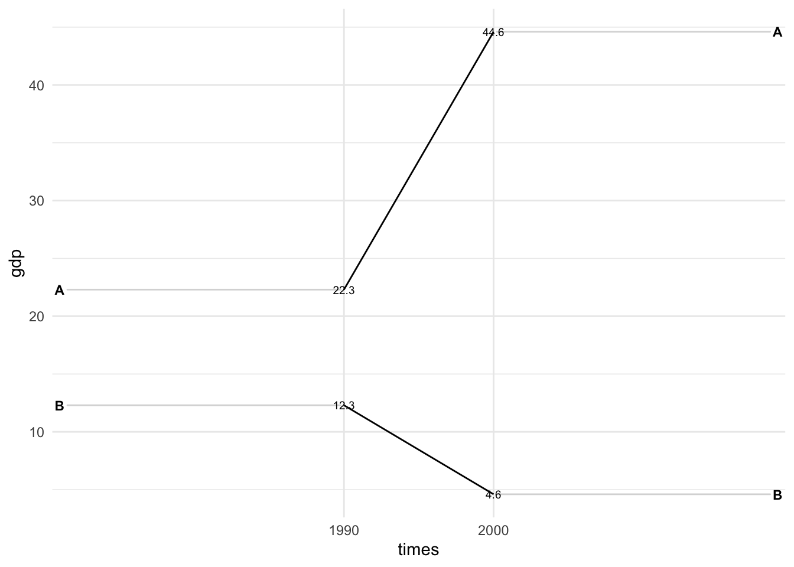

<!-- README.md is generated from README.Rmd. Please edit that file -->

# edgar 

<!-- badges: start -->
<!-- badges: end -->

This is a personal R package for different stuff made with R. It
installs the source code of illustrations, apps, and functions that I
wanted to recycle (e.g., slope plots with `ggplot2`). Feel free to reuse
the code for your own projects, but of course, you can install this
package as well.

## Installation

You can install the package from my [GitHub](https://github.com/)
account:

``` r
# install.packages("devtools")
devtools::install_github("edgar-treischl/edgar")
```

The rest of this page provides an example of the package’s content. You
can find more examples under articles.

## Shiny Apps

I created several shiny apps for different purposes. For example, the
`power` app illustrates what statistical power is and how it depends on
the sample size, effect size, and significance level by letting the user
adjust those parameters on the fly.

[](http://rstudio.edgar-treischl.de/shiny/power/)

## Illustrations

Every now and then I searched in my own code for a specific graph that I
wanted to reuse. The package includes some of the graphs that I created
which might be a good starting point for my future self or for your own
project. The `plotgraph()` function runs the installed source code and
returns the graphs. For example, do you know the `datasaurus` plot?

``` r
# plotgraph function runs the source code
library(edgar)
plotgraph("datasaurus.R")
```


Without input, the `plotgraph()` function returns available graphs.

``` r
# list available graphs without input
plotgraph()
#> Error in plotgraph(): Please run `plotgraph()` with a valid argument.
#> Valid examples are:
#> anscombe_quartet.R
#> boxplot_illustration.R
#> boxplot_pitfalls.R
#> data_joins.R
#> datasaurus.R
#> gapminder.R
#> long_wide.R
#> pacman.R
#> simpson.R
#> ucb_admission.R
```

## Graphs

And the package gives access to helper functions to make or improve
`ggplot2` graphs. For example, `ggslope()` returns a slope plot and you
may reuse it if you provide the necessary data. The function is a
wrapper for `geom_segment()` and `geom_text()` and is useful to compare
the change of a variable over time or between groups. The following code
shows how to use the function.

``` r
library(tidyr)
library(ggplot2)

#example data
df <- tribble(
 ~times, ~country,  ~gdp, ~inc,
 "1990",   "A",  22.3, TRUE,
 "2000",   "A",  44.6, TRUE,
 "1990",   "B",  12.3, FALSE,
 "2000",   "B",  4.6, FALSE
 )

#slope plot
ggslope(df, 
        times = times,
        outcome = gdp,
        group = country)+
  theme_minimal()
```


