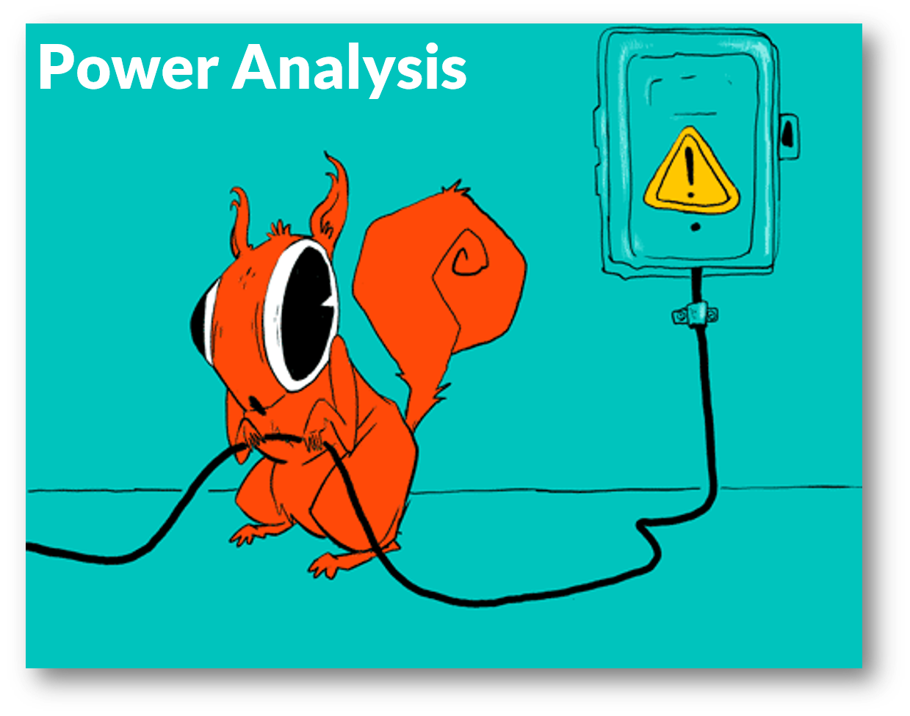

```{r, include = FALSE}
library(edgar)
knitr::opts_chunk$set(
  collapse = TRUE,
  comment = "#>"
)
```

The package provides the source code of illustrations, shiny apps, and functions to make `ggplot2` graphs.


## Apps: Power Analysis

[{width="694"}](http://rstudio.edgar-treischl.de/shiny/power/)

## Illustrations

The package installs the source code for all illustrations from this website. The `plotgraph()` function just picks the installed source code and returns the graphs. For example, the `datasaurus` plot.

```{r, eval=FALSE}
## basic example code
library(edgar)
plotgraph("datasaurus.R")
```


```{r, echo=FALSE, fig.alt='Data saurus by Edgar Treischl'}
knitr::include_graphics("web_only/illustrations/saurus.png")
```


Inspect the website to for a specific graph. Without input, the `plotgraph()` function returns all available graphs.

```{r example, warning=TRUE, error=TRUE}
plotgraph()
```


## Graphs

And the package gives access to shortcut functions to make `ggplot2` graphs. For example, `ggslope()` returns a slope plot.

```{r}
library(tidyr)
library(ggplot2)
df <- tribble(
 ~times, ~country,  ~gdp, ~inc,
 "1990",   "A",  22.3, TRUE,
 "2000",   "A",  44.6, TRUE,
 "1990",   "B",  12.3, FALSE,
 "2000",   "B",  4.6, FALSE
 )

ggslope(df,
         times = times,
         outcome = gdp,
         group = country)+
  theme_minimal()
```
