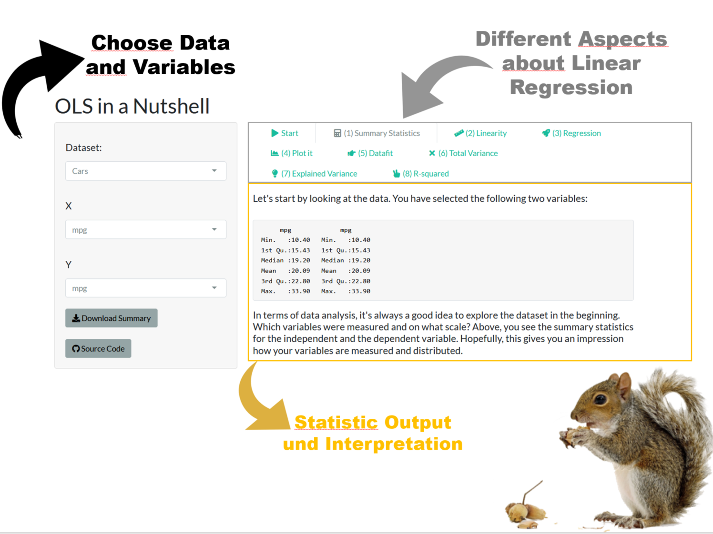

```{r, include = FALSE}
knitr::opts_chunk$set(
  collapse = TRUE,
  comment = "#>"
)

knitr::opts_chunk$set(
  fig.retina = 3,
  warning = FALSE,
  message = FALSE
)
```

I created several shiny apps for different purposes and audiences. 

On this site I share apps that I created for teaching purposes. Most of them will demonstrate the use of statistical methods for Socal Science students. My package contains the source code for my shiny apps. You can run them locally or visit the links below to see them in action. To run them locally, you need to install the package from GitHub. Next, you can run the apps via the run_app() function. It's just a wrapper for shiny::runApp() and it includes the path to the app. However, if the function gets no input, it returns a list with available apps. 


```{r, error=TRUE}
# Runs apps via run_app() or inspect available apps
edgar::run_app()
```


## Linear Regression app

The Linear Regression app is a simple app that demonstrates the use of the lm() function in R. The app allows you to pick different data sets and to run a linear regression model. The app shows different aspects about linear regression models, such as the interpretation of coefficients, the residuals, the fitted values, and the error.

[{width="694"}](http://rstudio.edgar-treischl.de/shiny/ols/)


## Titanic app

The Titanic app is a simple app that demonstrates the use of logistic regression in R. The app does essentially the same as the Linear Regression app, but it uses a logistic regression model instead and lies the focus on the interpretation of a logistic regression. The app uses the classic Titanic data set and predicts the survival of passengers based on different variables.

[{width="694"}](http://rstudio.edgar-treischl.de/shiny/titanic/)


## Power analysis app

The `power` analysis app illustrates what statistical power is; how it depends on the sample size, effect size, and significance level by letting the user adjust those parameters on the fly. The app uses the `pwr` package to calculate the statistical power or the needed sample size depending on the user input. The app shows how the picked parameters increase or decrease the statistical power (sample size, etc.) given the chosen parameters.

[{width="694"}](http://rstudio.edgar-treischl.de/shiny/power/)


