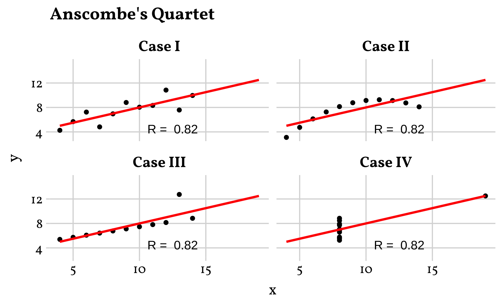
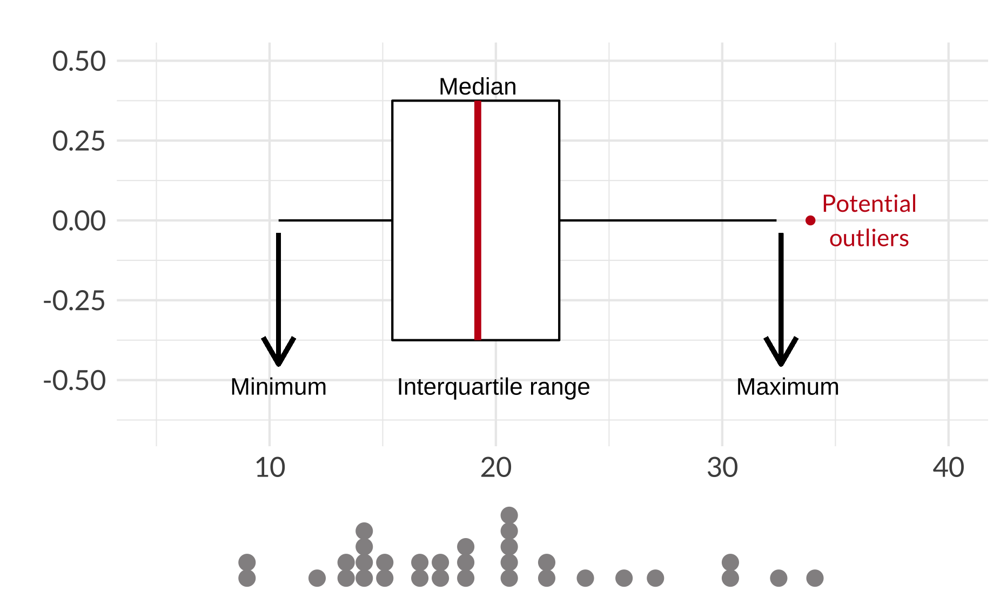
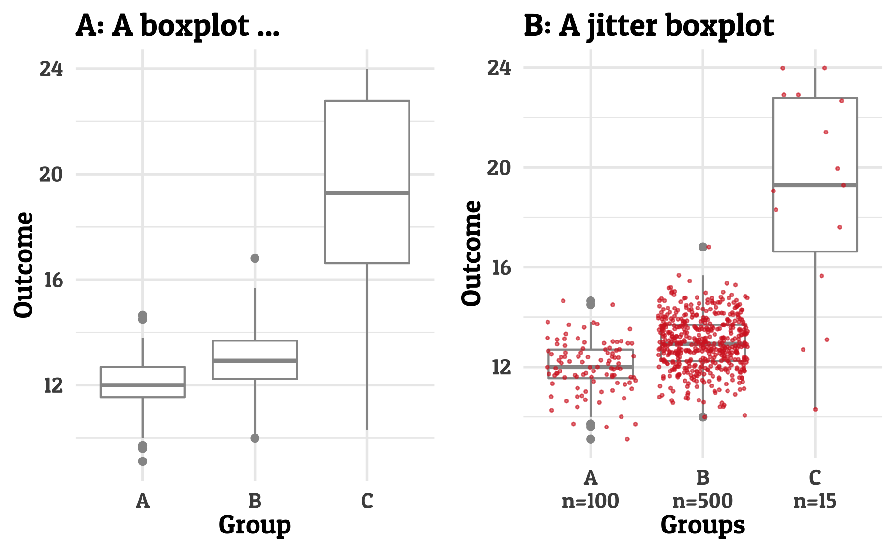
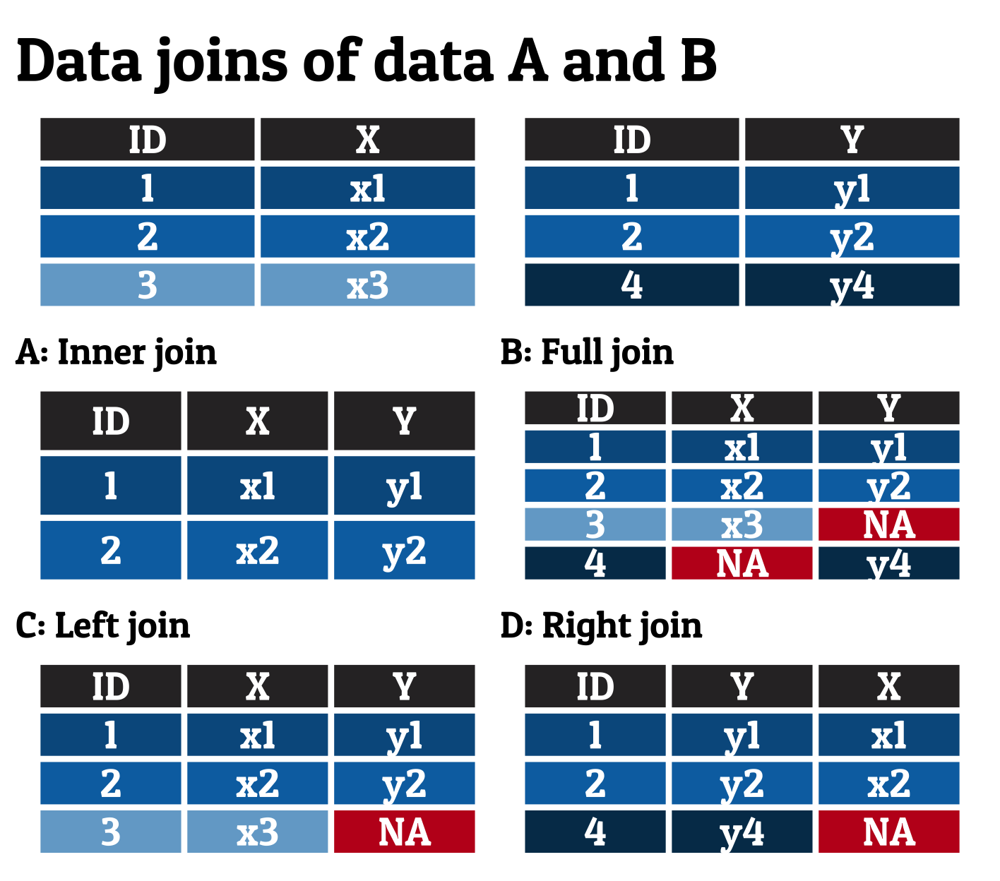
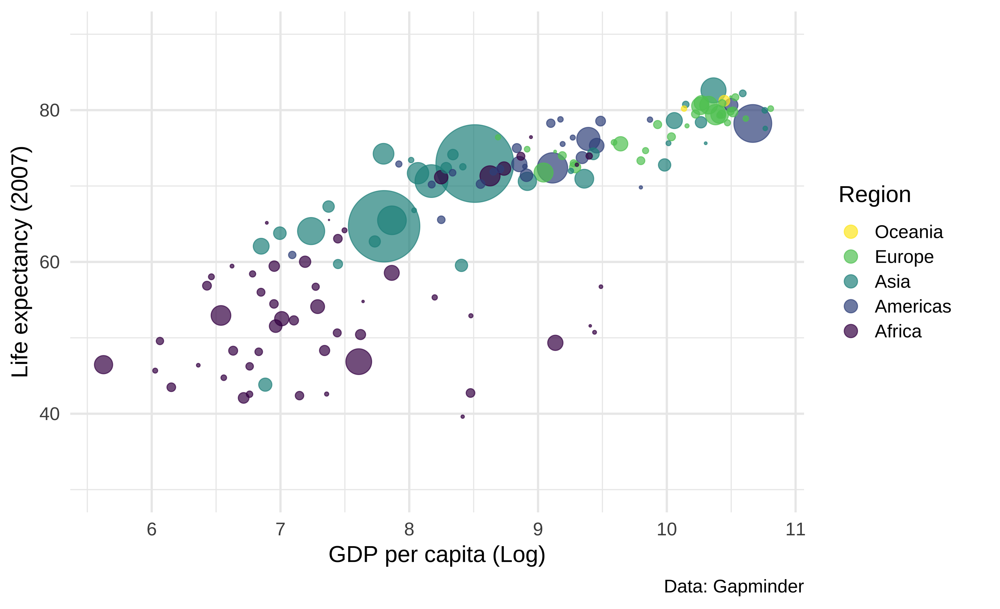
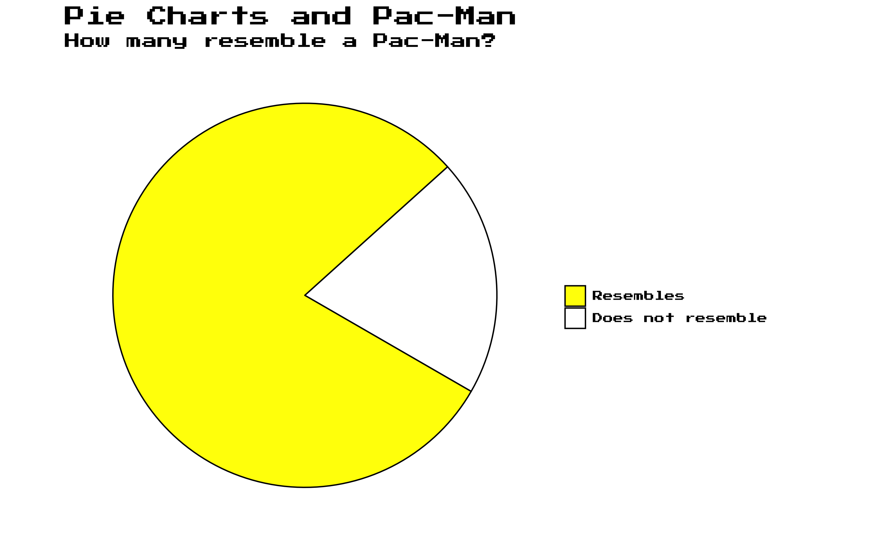
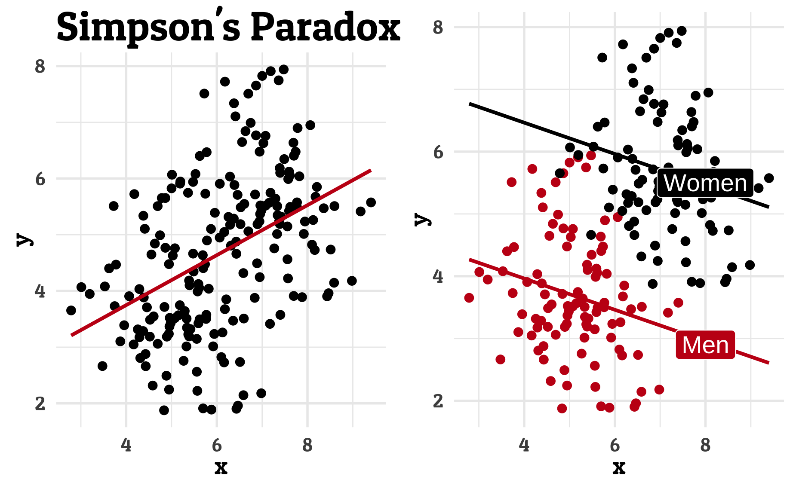
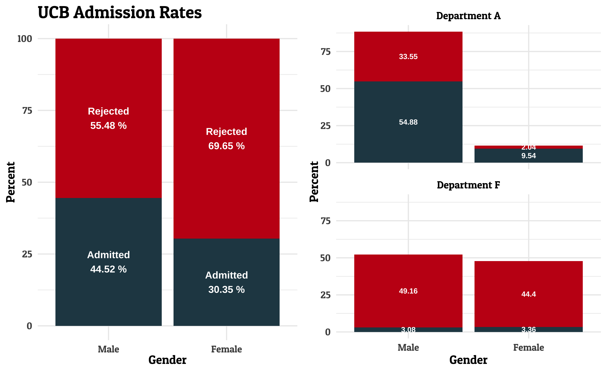

```{r, include = FALSE}
knitr::opts_chunk$set(
  collapse = TRUE,
  comment = "#>"
)

knitr::opts_chunk$set(fig.retina = 3, 
                      warning = FALSE, 
                      message = FALSE)

Rmd_Files <- list.files(path = "Rmd/", pattern = ".Rmd")
path <- paste( "Rmd/", Rmd_Files, sep = "" )
#source("Rmd/utils.R")

```
This page shows illustration of well-known graphs.

## Anscombe quartet

```{r anscombe_quartet, eval=FALSE}
library(edgar)
plotgraph("anscombe_quartet.R")
```

```{r, echo=FALSE, fig.alt='Anscombe quartet by Edgar Treischl'}

```

## Boxplot Illustration

```{r boxplot1, eval=FALSE}
plotgraph("boxplot_illustration.R")
```

```{r, echo=FALSE, fig.alt='Boxplot Illustration by Edgar Treischl'}

```

## Boxplot pitfalls

```{r boxplot2, eval=FALSE}
plotgraph("boxplot_pitfalls.R")
```

```{r, echo=FALSE, fig.alt='Boxplot Pitfalls by Edgar Treischl'}

```


## Data format


```{r, eval=FALSE}
plotgraph("long_wide.R")
```

```{r, echo=FALSE, fig.alt='Data joins by Edgar Treischl'}
knitr::include_graphics("long_wide.png")
```

## Data joins


```{r joins, eval=FALSE}
plotgraph("data_joins.R")
```

```{r, echo=FALSE, fig.alt='Data joins by Edgar Treischl'}

```

## Data saurus


```{r datasaurus, eval=FALSE}
plotgraph("datasaurus.R")
```

```{r, echo=FALSE, fig.alt='Data saurus by Edgar Treischl'}
knitr::include_graphics("saurus.png")
```


## Gapminder


```{r gapminder, eval=FALSE}
plotgraph("gapminder.R")
```

```{r, echo=FALSE, fig.alt='Gapminder by Edgar Treischl'}

```


## Pac-Man

```{r pacman, eval=FALSE}
Graphs::plotgraph("pacman.R")
```

```{r, echo=FALSE, fig.alt='The Pacman plot by Edgar Treischl'}

```


## Simpson's paradox

```{r simpson, eval=FALSE}
Graphs::plotgraph("simpson.R")
```

```{r, echo=FALSE, fig.alt='Simpsons Paradox by Edgar Treischl'}

```

## UCB Admission

```{r ucb, eval=FALSE}
Graphs::plotgraph("ucb_admission.R")
```

```{r, echo=FALSE, fig.alt='UCB Plot by Edgar Treischl'}

```


