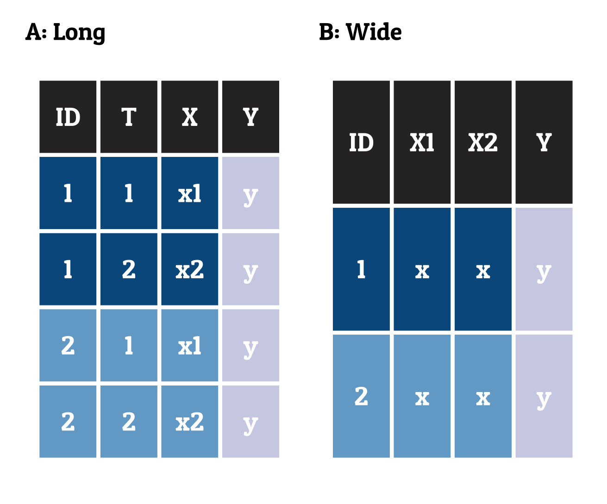

```{r, include = FALSE}
knitr::opts_chunk$set(
  collapse = TRUE,
  comment = "#>"
)

knitr::opts_chunk$set(fig.retina = 3, 
                      warning = FALSE, 
                      message = FALSE)

Rmd_Files <- list.files(path = "Rmd/", pattern = ".Rmd")
path <- paste( "Rmd/", Rmd_Files, sep = "" )
#source("Rmd/utils.R")

```

Every now and then I searched in my own code for a specific graph that I wanted to reuse. The package includes some of the graphs that I created which might be a good starting point for my future self or for your own project. The `plotgraph()` function runs the installed source code and returns the graphs. For example, do you know the `datasaurus` plot?

```{r, eval=FALSE}
# plotgraph function runs the source code
library(edgar)
plotgraph("datasaurus.R")
```

```{r, echo=FALSE, fig.alt='Data saurus by Edgar Treischl'}
knitr::include_graphics("saurus.png")
```

Without input, the `plotgraph()` function returns available graphs.

```{r example, warning=TRUE, error=TRUE}
# list available graphs without input
plotgraph()
```

## Anscombe quartet


Anscombe quartet is a set of four datasets that have nearly identical simple descriptive statistics, yet appear very different when graphed. Each dataset consists of eleven (x,y) points. They were constructed in 1973 by the statistician Francis Anscombe to demonstrate both the importance of graphing data before analyzing it and the effect of outliers on statistical properties.

```{r anscombe_quartet, eval=FALSE}
plotgraph("anscombe_quartet.R")
```

```{r, echo=FALSE, fig.alt='Anscombe quartet by Edgar Treischl'}

```

## Boxplot Illustration

The Boxplot Illustration shows the main components of a boxplot. The boxplot is a standardized way of displaying the distribution of data based on a five-number summary: minimum, first quartile, median, third quartile, and maximum. It can also show outliers. 


```{r boxplot1, eval=FALSE}
plotgraph("boxplot_illustration.R")
```

```{r, echo=FALSE, fig.alt='Boxplot Illustration by Edgar Treischl'}

```

## Boxplot pitfalls

The Boxplot pitfalls shows the main problem with boxplots. A boxplot shows the distribution of a dataset, but not the underlying data. A jitter plot is added to show the underlying data.

```{r boxplot2, eval=FALSE}
plotgraph("boxplot_pitfalls.R")
```

```{r, echo=FALSE, fig.alt='Boxplot Pitfalls by Edgar Treischl'}
knitr::include_graphics("boxplot2.png")
```


## Data format

The data format shows the difference between long and wide data format. The long format is often preferred for data analysis and visualization. The wide format is often preferred for data storage and data entry.


```{r, eval=FALSE}
plotgraph("long_wide.R")
```

```{r, echo=FALSE, fig.alt='Data joins by Edgar Treischl'}

```

## Data joins

The plot shows the different types of joins inspired by the [Data Wrangling with dplyr and tidyr](https://r4ds.hadley.nz/joins.html) chapter from the R for Data Science book. The plot shows the different types of joins: inner, left, right, and full join.


```{r joins, eval=FALSE}
plotgraph("data_joins.R")
```

```{r, echo=FALSE, fig.alt='Data joins by Edgar Treischl'}
knitr::include_graphics("joins.png")
```

## Data saurus

The datasaurus plot shows the importance of visualizing data. The datasaurus plot shows the same summary statistics for 12 datasets. The plot shows the importance of visualizing data before analyzing it. The datasaurus plot is inspired by the [Datasaurus Dozen](https://www.autodeskresearch.com/publications/samestats) paper.


```{r datasaurus, eval=FALSE}
plotgraph("datasaurus.R")
```

```{r, echo=FALSE, fig.alt='Data saurus by Edgar Treischl'}
knitr::include_graphics("saurus.png")
```


## Gapminder

The Gapminder bubble chart shows the life expectancy and GDP per capita for countries over time. The Gapminder bubble chart is inspired by the [Gapminder](https://www.gapminder.org/) project.


```{r gapminder, eval=FALSE}
plotgraph("gapminder.R")
```

```{r, echo=FALSE, fig.alt='Gapminder by Edgar Treischl'}
knitr::include_graphics("gapminder.png")
```


## Pac-Man

The Pac-Man plot shows how many pie charts resemble Pac-Man.

```{r pacman, eval=FALSE}
Graphs::plotgraph("pacman.R")
```

```{r, echo=FALSE, fig.alt='The Pacman plot by Edgar Treischl'}
knitr::include_graphics("pacman.png")
```


## Simpson's paradox

The [Simpson's paradox](https://en.wikipedia.org/wiki/Simpson%27s_paradox) plot shows how the correlation between two variables can change when a third variable is added. It underlines the importance of visualizing data and causal inference, since overall it may seem that there is positive correlation, but when the data is split into groups, the correlation can be negative.

```{r simpson, eval=FALSE}
Graphs::plotgraph("simpson.R")
```

```{r, echo=FALSE, fig.alt='Simpsons Paradox by Edgar Treischl'}
knitr::include_graphics("simpson.png")
```

## UCB Admission

Where students discriminated? The UCB Admission plot shows the admission rates for different departments at the University of California, Berkeley. The UCB Admission case illustrates the importance of causal inference since it seems that more women were rejected, but when the data is split into departments, the opposite can be true.

```{r ucb, eval=FALSE}
edgar::plotgraph("ucb_admission.R")
```

```{r, echo=FALSE, fig.alt='UCB Plot by Edgar Treischl'}

```


